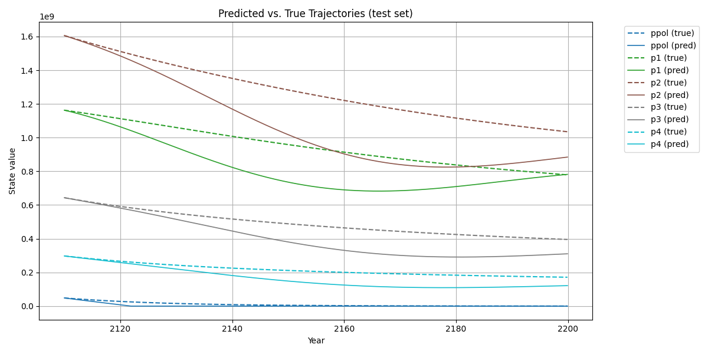
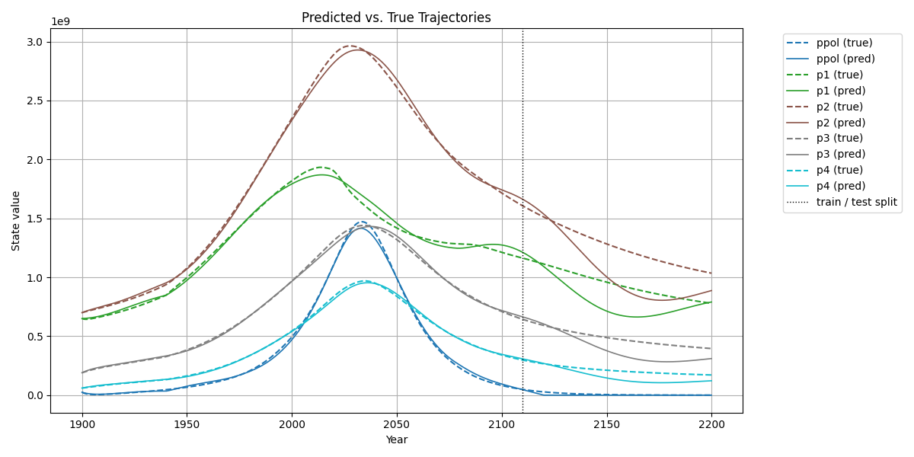
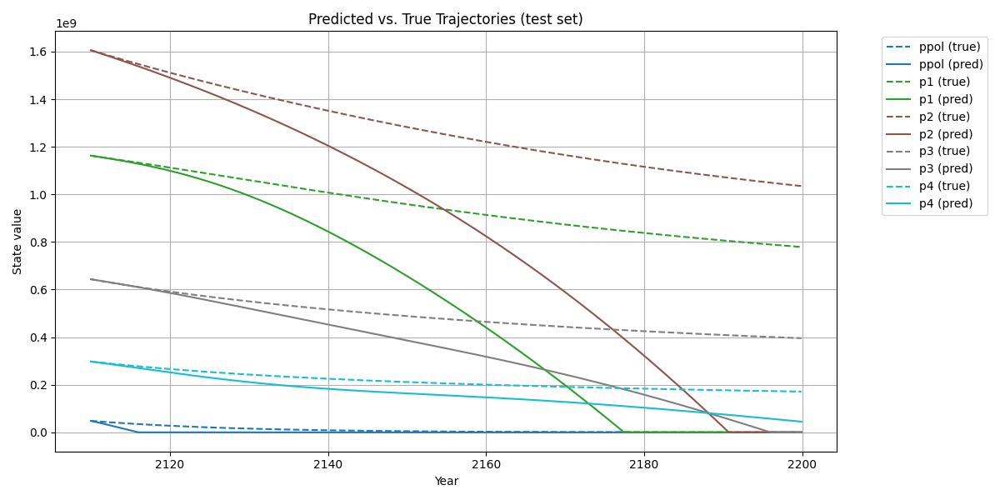
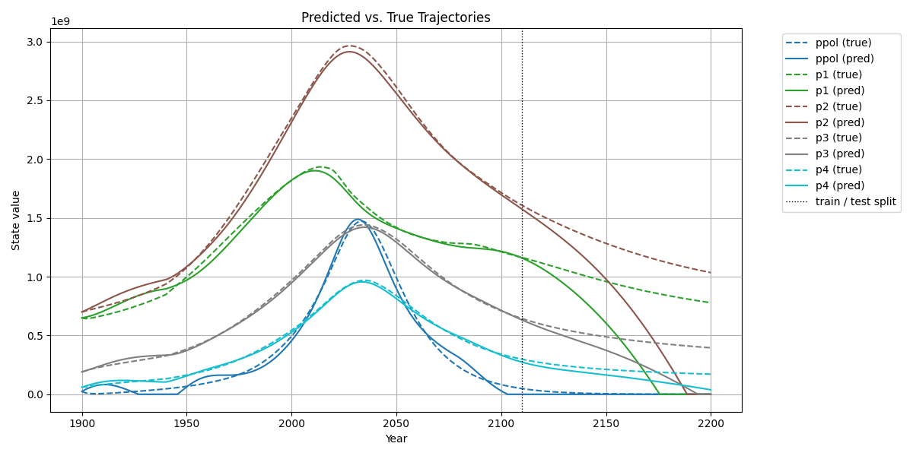

# Project README

This repository contains two Python scripts that apply system identification techniques to the World3 simulation model.

## sindy.py

**Description:**
- Implements the Sparse Identification of Nonlinear Dynamics (SINDy) algorithm to learn a compact dynamical model of the World3 state variables using a polynomial feature library (degree 2).

**Inputs:**
- Simulated World3 state trajectories for:
  - Persistent Pollution (ppol).
  - Population age groups (p1, p2, p3, p4).
- Control input time series for:
  - Persistent Pollution Generation Factor (ppgf).
  - Persistent Pollution Transmission Delay (pptd).
  - Lifetime Multiplier from Health Services (lmhs).
- Time step \(dt\) for simulation.

**Outputs:**
- Printed SINDy model equations (coefficients for each term).
- Training, test, and overall model fit scores
- RMSE and relative RMSE metrics for each state variable.
- Forecast plots:
  - `sindy_test.png` (test-set prediction vs. true).
  - `sindy_full.png` (full-range prediction vs. true).

  
  

## RK4-sindy.py

**Description:**
- Implements an RK4-inspired extension of SINDy (RK4-SINDy) using fixed cutoff thresholding to identify the World3 dynamics.

**Inputs:**
- Same state and control trajectories as above
- Time step \(dt\).
- RK4-SINDy parameters:
  - Polynomial library degree (2).
  - Threshold for coefficient pruning.
  - Maximum iterations for sequential thresholding.

**Outputs:**
- Printed RK4-SINDy model equations.
- Training, test, and overall fit scores (R²).
- RMSE and relative RMSE metrics.
- Forecast plots:
  - `rk4_sindy_test.png`
  - `rk4_sindy_full.png`

  
