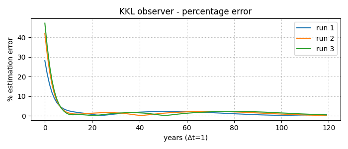

# Project README

This repository contains three standalone Python scripts that showcase *state estimation* and *control* for a reduced, four-state slice of the **World3** model.

---

## kkl_demo_world3.py

**Description**  
Trains and tests a *physics-informed* **K**azantzis–**K**ravaris–**L**uenberger (KKL) observer built from two small MLPs.  

The observer estimates

* persistent pollution **ppol**  
* population cohorts **p2**, **p3**, **p4**

using only the measured cohorts **p2** and **p3**.

**Inputs**

* BAU simulation of World3, years 1900 – 2200, Δt = 1 yr  
* No external controls (default policy)

**Outputs**

* Trained networks are kept in memory only  
* Figure `kkl_observer.png` – percentage estimation error for three blind roll-outs  
  

---

## kkl_observer.py

**Description**  
Reusable implementation of the **KKLObserver** class:

* sequential training (`fit_T`, `fit_Tinv`) with physics/PDE loss  
* online `step()` function (contracting or Luenberger mode)

**Typical use**

```python
from kkl_observer import KKLObserver
obs = KKLObserver(A, B, C, state_names, meas_names)
obs.fit_T(Xn, Yn);  obs.fit_Tinv(Xn)
x_hat = obs.step(y, dt)
```

This script *does not* run anything by itself — it is imported by the two demos.

---

## `SciML_controller.py`

### Description  
End-to-end **Scientific-ML** controller:

1. **Data stage** (1900 – 2024)  
   * excites the inputs **ppgf** & **pptd** with smooth sinusoids  
   * fits a degree-2 polynomial SINDy surrogate and stores `theta.pt`
2. **Online MPC** (3-year horizon, gradient descent)  
   * re-planned every 2 years, subject to box constraints  
3. **Behavioural cloning** replaces MPC with a 2-layer ReLU network for speed

### Inputs
* Cached surrogate coefficients (`theta.pt`) **or** raw data generated on first run  
* Control limits `CTRL_BOX` and cost weights (`W_PP`, `W_POP`, `W_U`) defined at the top of the file  

### Outputs

| file                  | content                                   |
|-----------------------|-------------------------------------------|
| `SciML_controller.png`| PPOL and total population trajectories    |
| `SciML_controls.png`  | applied **PPGF** and **PPTD** inputs      |

The script also prints RMSE diagnostics in the terminal.

---

## Quick start

```bash
# create & activate environment (≈2 min)
conda create -n sciml python=3.10 pip
conda activate sciml
pip install pyworld3 torch numpy matplotlib casadi pysindy

# train + plot observer
python kkl_demo_world3.py

# run closed-loop controller
python SciML_controller.py
```